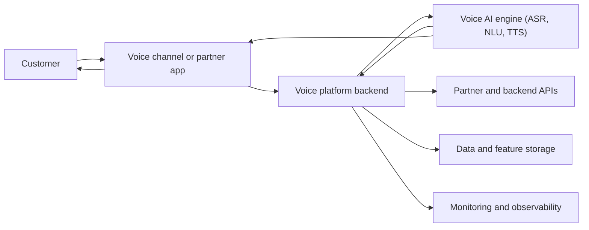
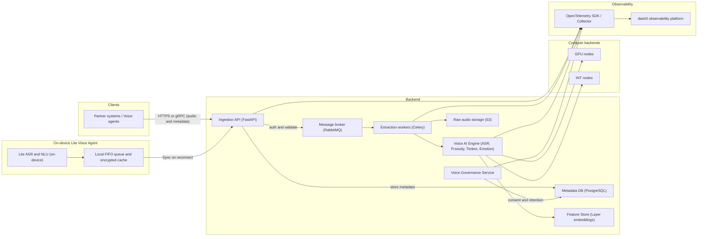

# Software-Engineering-Basic
Master Course Software Engineering Basic

Very simplified version 


Whithout AI Engine specification 


Whith AI Engine specification 

```mermaid
flowchart LR

  %% Clients
  subgraph Clients
    customer["Customer"]
    partner["Voice channel or partner platform"]
  end

  %% Edge / offline mode
  subgraph Edge["On-device Lite Voice Agent"]
    edgeASR["Lite ASR and NLU on device"]
    edgeQueue["Local FIFO queue and encrypted cache"]
    edgeASR --> edgeQueue
  end

  customer --> partner
  partner -->|"HTTPS or gRPC (audio and metadata)"| ingestionAPI
  edgeQueue -->|"Sync on reconnect"| ingestionAPI

  %% Core backend
  subgraph Backend
    ingestionAPI["Ingestion API (FastAPI)"]
    mq["Message broker (RabbitMQ)"]
    workers["Extraction workers (Celery)"]
    governance["Voice Governance Service"]
    rawStore["Raw audio storage (S3)"]
    metaDB["Metadata DB (PostgreSQL)"]
    featureStore["Feature Store (Layer embeddings)"]

    subgraph VoiceAI["Voice AI Engine (runtime detail)"]
      asr["ASR (speech to text)"]
      nlu["NLU or LLM (intent and context)"]
      dialog["Dialog orchestrator (business logic)"]
      tts["TTS (brand voice synthesis)"]
    end
  end

  %% Backend data flow
  ingestionAPI -->|"auth and validate"| mq
  ingestionAPI -->|"store metadata"| metaDB
  mq --> workers
  workers --> rawStore
  workers --> asr
  asr --> nlu --> dialog --> tts
  tts --> featureStore

  %% Runtime voice loop
  partner --> asr
  tts --> partner
  partner --> customer

  %% External systems used by dialog
  backendAPIs["Partner and backend APIs (Shopify, internal systems)"]
  dialog -->|"read and write data"| backendAPIs

  %% Compute backends
  subgraph Compute["Compute backends"]
    gpu["GPU nodes"]
    intNode["INT nodes"]
  end

  asr --> gpu
  nlu --> gpu
  tts --> intNode

  %% Observability
  subgraph Observability
    otel["OpenTelemetry SDK or Collector"]
    dash0["dash0 observability platform"]
  end

  ingestionAPI --> otel
  workers --> otel
  asr --> otel
  nlu --> otel
  dialog --> otel
  tts --> otel
  governance --> otel
  otel --> dash0
  ```
