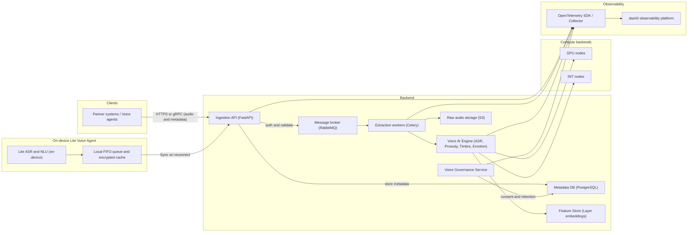

# Software-Engineering-Basic
Master Course Software Engineering Basic

```mermaid
flowchart LR

  %% Clients
  subgraph Clients
    partner["Partner systems / Voice agents"]
  end

  %% Edge / offline mode
  subgraph Edge["On-device Lite Voice Agent"]
    edgeASR["Lite ASR and NLU (on-device)"]
    edgeQueue["Local FIFO queue and encrypted cache"]
    edgeASR --> edgeQueue
  end

  partner -->|"HTTPS or gRPC (audio and metadata)"| ingestionAPI
  edgeQueue -->|"Sync on reconnect"| ingestionAPI

  %% Core backend
  subgraph Backend
    ingestionAPI["Ingestion API (FastAPI)"]
    mq["Message broker (RabbitMQ)"]
    workers["Extraction workers (Celery)"]
    voiceEngine["Voice AI Engine (ASR, Prosody, Timbre, Emotion)"]
    governance["Voice Governance Service"]
    rawStore["Raw audio storage (S3)"]
    metaDB["Metadata DB (PostgreSQL)"]
    featureStore["Feature Store (Layer embeddings)"]
  end

  ingestionAPI -->|"auth and validate"| mq
  ingestionAPI -->|"store metadata"| metaDB
  mq --> workers
  workers --> rawStore
  workers --> voiceEngine
  voiceEngine --> featureStore
  governance -->|"consent and retention"| metaDB

  %% Compute backends (GPU & INT)
  subgraph Compute["Compute backends"]
    gpu["GPU nodes"]
    intNode["INT nodes"]
  end

  voiceEngine --> gpu
  voiceEngine --> intNode

  %% Observability
  subgraph Observability
    otel["OpenTelemetry SDK / Collector"]
    dash0["dash0 observability platform"]
  end

  ingestionAPI --> otel
  workers --> otel
  voiceEngine --> otel
  governance --> otel
  otel --> dash0
```
